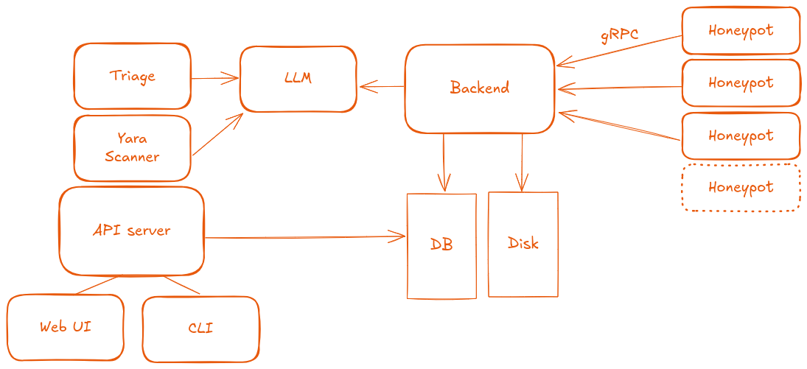
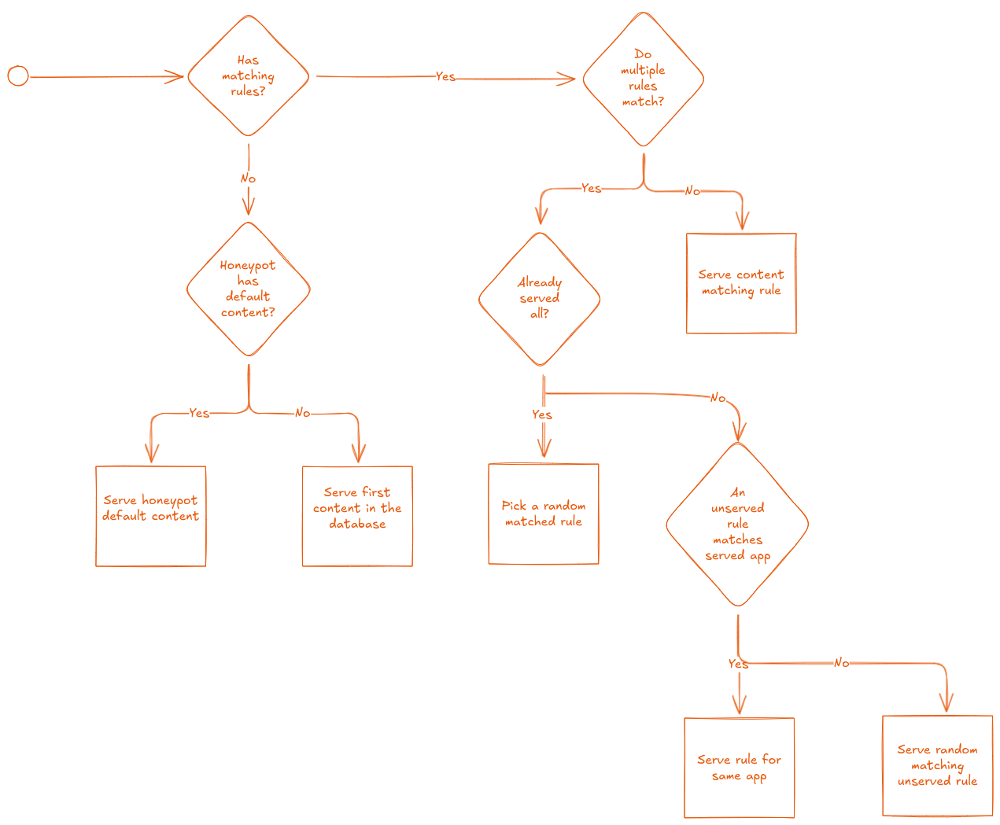

# lophiid

  

## Introduction

Lophiid is a distributed honeypot for detecting and interacting with mass web
application exploitation attempts.

The design of lophiid is that one backend controls multiple honeypot sensors
agents across the web. Each honeypot can be configured individually but the
backend is able to track interactions with attackers across all of them.

Say an attacker scans for / across the internet and it hits 50 lophiid
honeypots. The backend can make sure that during each individual interaction
with a honeypot a different response is send to the attacker and with that
increases the chance that the attacker gets something they are looking for which
can result in further interaction.

Similarly lophiid can respond differently to multiple command injections against
the same endpoint.

Key features:

- A distributed honeypot approach
- Rule based interactions with attacks
- Support both static and scripted (Javascript) response handling
- Alerting possible (Telegram, extensible)
- UI with comprehensive search
- Automatic tagging of requests and attacks to help triage
- Automatically collects malware
- Direct integration with VirusTotal
- Ratelimiting / DoS protection
- Exporting of rules for sharing with the community
- Extensive metrics for prometheus/grafana
- Highly customizable

Running lophiid is already very interesting and you'll collect a lot of threat
information. The project is still in an early phase of development though and
large changes are still to be expected in the near future.

## Detailed Description
### Components

Lophiid is build out of the following components:

The backend contains all the business logic and honeypots connect via the
internet using gRPC (SSL client certs). The backend interacts with the postgres
database and also write payloads it got from attacks to disk.

The API server interacts with the database and allows the CLI and UI to view and
interact with the data collected from the honeypots. When the API server makes
some changes to the database (e.g. it adds a rule) then it might take a few minutes
before the backend server acts on the change due to caching (for performance).
The CLI and UI use HTTPS with an API key to interact with the API server.

The honeypots are super simple agents and rely on the backend for almost
anything. One special case is that the backend can tell a honeypot for download
malware from an HTTP endpoint that was previously extracted from a request that
hit that same honeypot. The honeypot in this case will download the malware and
send it to the backend using gRPC.

### Rule based content serving

The most basic operation with lophiid is to create static content and tie it to
a rule. The rule can have all kinds of conditions which a request needs to meet
before the content is served.

If the request matches multiple rules then each time the same request is seen
(and this can be across multiple honeypots, as longs as the source IP is the
same) a previously not served content is served. If one of the not served content has the same application ID as a rule that was served prior to the attacker then this rule will get priority.

Now "content" can be static but it can also be a script (JavaScript). If it's a
script than then that script gets executed and gets access to the matching
request. The script can then parse the request and define the response the
honeypot needs to send back.  For example, some payloads want the target to echo
a random string and so the script could parse the string from the request and
echo it back to the requester.  More information about scripted responses found
[here](./SCRIPTING.md).

When a request matches no rule at all then the honeypot will send a
default response which is configurable per honeypot.

A general overview of rule matching is presented in the image below:

### Request processing

The backend analyses requests for possible payload URLs and downloads these via
the honeypots. The downloaded content is uploaded and scanned with VirusTotal
(optional) using the free API quota anyone can get.

More information about payload fetching can be found here: [Payload fetching](./PAYLOAD_FETCHING.md)

Additionally the backend will perform whois lookups of the source IPs and also,
if configured, collects OS fingerprinting information from p0f instances running
on the honeypot systems. All this information is available in the UI.

### Queries and labels

In the UI you can store queries for two purposes. First it can just be handy to
have a long query stored for future use. Second, it is possible to attach labels
to queries in which case the backend will regularly run this query and apply
those labels to any request that matched the query.  You can also search for such
labels in the Requests tab of the web UI.

For example, you could make a query that tries to find all `curl` commands and
then apply the label `curl` to those requests. Once done you can go to the UI and
search with `label:curl` and find such requests.

This way of tagging might be subject to change in the future where tagging might
be moved to the Rule logic of lophiid for performance reasons.

### UI and CLI

Lophiid comes with a UI for managing the backend and analyzing all honeypot
interactions. A core part of the UI is a search ability on all different data
types lophiid handles (documented [here](./SEARCH.md).

Below is an example page of the UI:

The CLI is currently very limited but can be used to easily copy content (and
create rules for) of public web sites. More information about how to use the CLI
can be found [here](./API_CLIENT.md).

# Documentation

* [Setup guide](./SETUP.md)
* [Screenshots](./SCREENSHOTS.md)
* [Scripted responses](./SCRIPTING.md)
* [API cli client usage](./API_CLIENT.md)
* [UI search - overview](./SEARCH.md)
* [UI search - all keywords](./SEARCH_KEYWORDS.md)
* [Payload fetching](./PAYLOAD_FETCHING.md)
